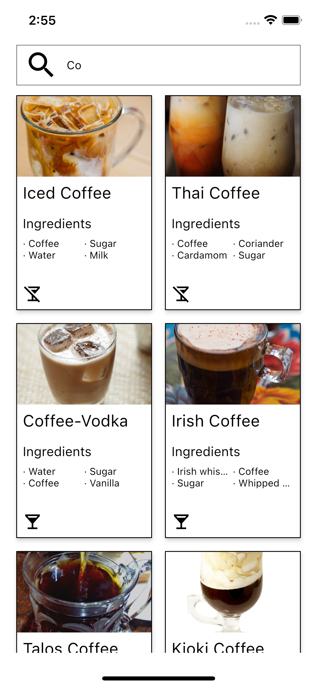

# COCKTAIL APP In Kotlin Multiplatform.

- [iOS](#ios)
> If you need to run the app on iOS and you have a mac. Open the iosApp folder in xcode and you can run the app.
- [Android](#android)
> If you need to run the app on Android. Open the project in Android studio and you can run the app.

## Libraries Used
- **Ktor:** Used for handling HTTP requests and networking operations.
- **Koin:** A lightweight dependency injection framework.
- **Room:** For local database.
- **Coil:** Efficiently loads and displays images.
- **Navigation Compose and Safe Ars** Utilized for navigation in a multiplatform environment.

## iOS
<table>
  <tr>
    <td align="center"></td>
    <td align="center"></td>
    <td align="center"></td>
    <td align="center"></td>
    
  </tr>
</table>

## Android
<table>
  <tr>
    <td align="center"></td>
    <td align="center"></td>
    <td align="center"></td>
    <td align="center"></td>
   
    
  </tr>
</table>

This is a Kotlin Multiplatform project targeting Android, iOS.

* `/composeApp` is for code that will be shared across your Compose Multiplatform applications.
  It contains several subfolders:
  - `commonMain` is for code that’s common for all targets.
  - Other folders are for Kotlin code that will be compiled for only the platform indicated in the folder name.
    For example, if you want to use Apple’s CoreCrypto for the iOS part of your Kotlin app,
    `iosMain` would be the right folder for such calls.

* `/iosApp` contains iOS applications. Even if you’re sharing your UI with Compose Multiplatform,
  you need this entry point for your iOS app. This is also where you should add SwiftUI code for your project.

